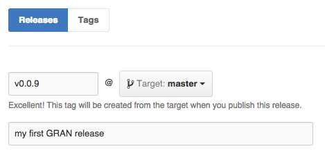
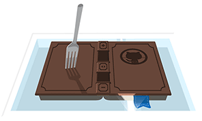
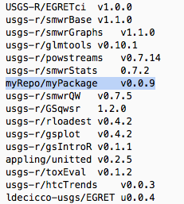
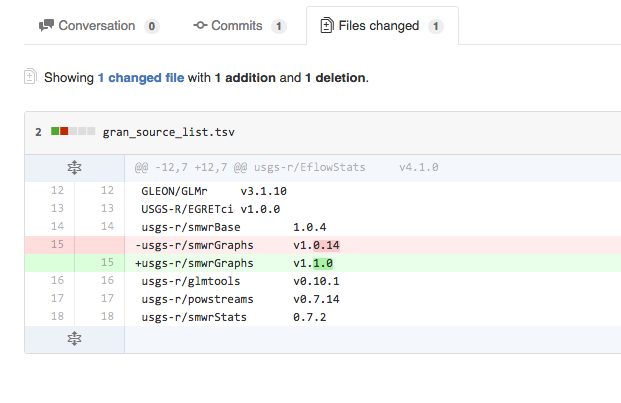

# grantools
Tools for the Geological survey R Archive Network

## adding a package to GRAN

see requirements for packages here: http://owi.usgs.gov/R/gran.html

If package requirements are met, including your package passing checks, existing on github, and being maintained by a usgs.gov email address, you can add a package to GRAN using the following instructions:

#### Tag a stable release of your package on github:  


#### Fork this repository: 

 
#### Add a pointer to your package in [inst/gran_src_list.tsv](https://github.com/USGS-R/grantools/blob/master/gran_source_list.tsv) 


#### Create a pull request of your change:  


#### Wait to be notified of any needed changes, or hear about success


## using grantools to build GRAN

#### building locally  
From R with the `grantools` package built locally:  
```r
library(grantools)
dl_build_src()
dl_build_bin()
```

#### building from jenkins  
Windows Powershell commands:
```r
if not exist gran_build_libs mkdir gran_build_libs
if not exist .Renviron echo "R_LIBS_USER=\"./gran_build_libs\"" > .Renviron

REM If the libs directory is still around, it may have 
REM libraries from the wrong version of R in it. Start fresh. 

rmdir gran_build_libs /S /Q
mkdir gran_build_libs
```

```
REM Set the PATH to not include R. This is a bit of a hack

set "PATH=C:\ProgramData\Oracle\Java\javapath;C:\Program Files (x86)\AMD APP\bin\x86_64;C:\Program Files (x86)\AMD APP\bin\x86;C:\Windows\system32;C:\Windows;C:\Windows\System32\Wbem;C:\Windows\System32\WindowsPowerShell\v1.0\;C:\Program Files (x86)\Git\cmd;C:\Program Files (x86)\MiKTeX 2.9\miktex\bin\;C:\Program Files\Amazon\AWSCLI\;C:\Program Files (x86)\Pandoc\"

set "PATH=c:\Rtools\bin;c:\Rtools\gcc-4.6.3\bin;C:\Program Files\R\R-3.1.3\bin;%PATH%"

pandoc --version

Rscript -e "install.packages('devtools', lib='gran_build_libs', repos='http://cran.us.r-project.org')"
Rscript -e "library(devtools);install_github('USGS-R/grantools');library(granbuild);dl_build_src();jenkins_build_bin()"
```

```
REM Set the PATH to not include R. This is a bit of a hack

set "PATH=C:\ProgramData\Oracle\Java\javapath;C:\Program Files (x86)\AMD APP\bin\x86_64;C:\Program Files (x86)\AMD APP\bin\x86;C:\Windows\system32;C:\Windows;C:\Windows\System32\Wbem;C:\Windows\System32\WindowsPowerShell\v1.0\;C:\Program Files (x86)\Git\cmd;C:\Program Files (x86)\MiKTeX 2.9\miktex\bin\;C:\Program Files\Amazon\AWSCLI\;C:\Program Files (x86)\Pandoc\"

set "PATH=c:\Rtools\bin;c:\Rtools\gcc-4.6.3\bin;C:\Program Files\R\R-3.2.2\bin;%PATH%"

rmdir gran_build_libs /S /Q
mkdir gran_build_libs

Rscript -e "install.packages('devtools', lib='gran_build_libs', repos='http://cran.us.r-project.org')"
Rscript -e "library(devtools);install_github('USGS-R/grantools');library(granbuild);jenkins_build_bin()"
```

##Disclaimer
This software is in the public domain because it contains materials that originally came from the U.S. Geological Survey, an agency of the United States Department of Interior. For more information, see the [official USGS copyright policy](http://www.usgs.gov/visual-id/credit_usgs.html#copyright/ "official USGS copyright policy")

Although this software program has been used by the U.S. Geological Survey (USGS), no warranty, expressed or implied, is made by the USGS or the U.S. Government as to the accuracy and functioning of the program and related program material nor shall the fact of distribution constitute any such warranty, and no responsibility is assumed by the USGS in connection therewith.

This software is provided "AS IS."

 [
    
  ](http://creativecommons.org/publicdomain/zero/1.0/)

